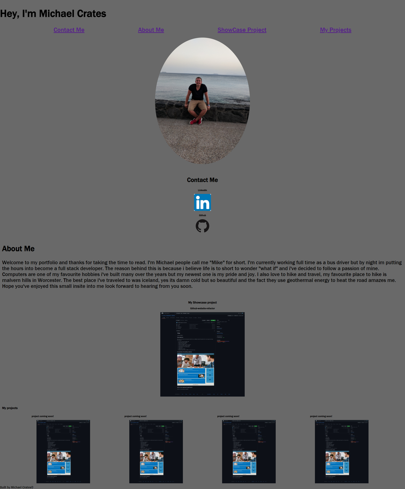

# title

My Portfolio

## Description

I've been tasked with creating my own portfolio to show off my skills as a developer.
I've done a;

- Concise title
- favicon on title
- Added nav bar
- All images have alts
- wrote my about me
- notes within the code
- projects are clickable to direct to that repo
- first project(showcase) is bigger then rest
- fits multiple screen sizes
- semantic html

## Screenshot

## link to deployed website

click [here](https://cratesy.github.io/my-portfolio/) for my portfolio.
